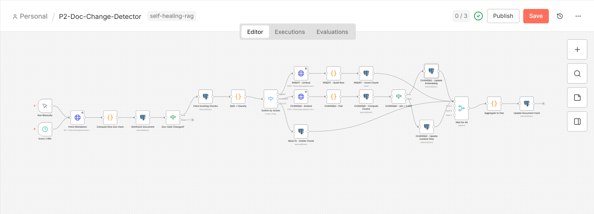
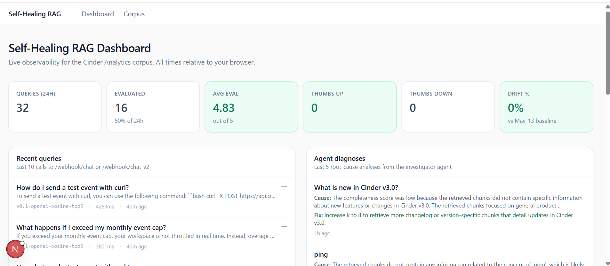
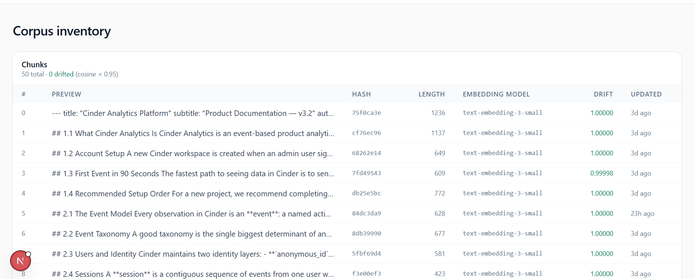
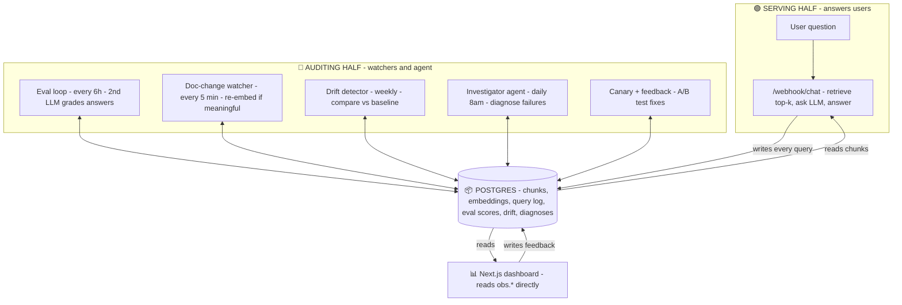
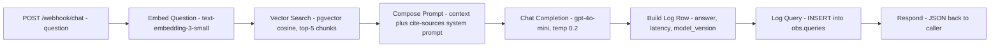

# Self-Healing RAG Pipeline

[](LICENSE)

[](https://github.com/jawwad-ali/self-healing-rag/commits)
[](https://github.com/jawwad-ali/self-healing-rag/stargazers)


A RAG system that watches its own answer quality, notices when it's getting worse, and fixes itself — without anyone telling it to.

Built on **n8n + Neon Postgres + OpenAI**, with a **Next.js** operator dashboard. No Python runtime required.

📖 **Full case study:** [alijawwad.com/projects/self-healing-rag →](https://www.alijawwad.com/projects/self-healing-rag)

> **Status: all 5 phases shipped.** 13 n8n workflows live, 3 schema migrations, 5 cron schedules running concurrently, plus a Next.js dashboard. The full closed loop — *grade → diagnose → A/B test → promote* — is proven end-to-end with real data (see [What's actually running right now](#-whats-actually-running-right-now)).

> **📖 This README also doubles as an interview guide.** If you're here to understand the project well enough to explain it out loud, read the [30-Second Pitch](#-the-30-second-pitch), then the [Interview Walkthrough](#-interview-walkthrough) at the bottom. Everything in between is the detail behind those two sections.

---

## 📑 Table of Contents

1. [The 30-Second Pitch](#-the-30-second-pitch)
2. [See It in Action](#-see-it-in-action)
3. [What This Project Is, in One Minute](#-what-this-project-is-in-one-minute)
4. [The Problem It Solves](#-the-problem-it-solves)
5. [What's Actually Running Right Now](#-whats-actually-running-right-now)
6. [The Architecture](#️-the-architecture-two-halves-one-database)
7. [The Technologies (and Why Each Was Chosen)](#-the-technologies-and-why-each-was-chosen)
8. [How the Main Features Work](#-how-the-main-features-work-the-6-phases)
9. [The Request / Response Flow](#-the-request--response-flow)
10. [The 13 Workflows at a Glance](#-the-13-workflows-at-a-glance)
11. [The Data Model](#-the-data-model)
12. [Key Technical Decisions & Trade-offs](#-key-technical-decisions--trade-offs)
13. [Challenges Faced & How They Were Solved](#-challenges-faced--how-they-were-solved)
14. [Repository Layout](#-repository-layout)
15. [Run It Locally](#-run-it-locally)
16. [Optional: AI-Driven Development via MCP](#-optional-ai-driven-development-via-mcp)
17. [Future Improvements](#-future-improvements)
18. [Interview Walkthrough](#-interview-walkthrough)
19. [Glossary](#-glossary-plain-english)

---

## 🎯 The 30-Second Pitch

If an interviewer says *"Walk me through this project,"* start here:

> "Most teams can build a basic RAG chatbot in an afternoon — look up documents, feed them to an LLM, return an answer. The hard part nobody builds is what keeps it healthy after week six. RAG **silently rots**: documents change, prices update, the embedding model drifts, and you only find out when a customer complains. So I built a RAG that monitors *itself*. Background 'watcher' workflows run on a schedule — they grade the system's own answers with a second, stronger LLM, detect when documents have meaningfully changed, measure embedding drift against a frozen baseline, and when quality drops, an **AI investigator agent diagnoses why and recommends a fix**. Phase 5 then **A/B tests that fix** with a canary deployment and only promotes it if the data says it actually helped. The whole thing runs in **n8n** with **Postgres as the single integration point** — the two halves (serving users vs. auditing the system) never call each other; they just share one database. I even proved the full loop end-to-end: the agent flagged a weak answer, recommended *'increase k to 8,'* the canary tested it 50/50, and the data confirmed a **+0.36 completeness** improvement."

Everything below is the long version of that paragraph.

---

## 📸 See It in Action

Snapshots from the running system — n8n on the workflow side, Next.js on the operator side.

**Phase 2 — the doc-change watcher.** Runs every 5 minutes, fetches the corpus from GitHub, hashes it, and exits in ~500 ms if nothing changed. When the doc *is* edited, the Switch node fans into INSERT / CHANGED-with-cosine-0.95-gate / DELETE branches that all converge through a wait-all merge before the document hash is finalized.



---

**The operator's dashboard.** Six color-coded health gauges across the top (AVG EVAL 4.83 / 5 in green, drift 0%, 32 queries in 24h), live recent queries on the left. On the right, the investigator agent's actual diagnoses — including its concrete recommendation to *"Increase k to 8 to retrieve more changelog or version-specific chunks"* for the v3.0 question, which Phase 5's canary then went on to validate.



---

**The corpus inventory page.** All 50 chunks from the Cinder Analytics docs listed with their content preview, content hash, embedding model, and most-recent drift score relative to the May-13 baseline. The `0 drifted (cosine < 0.95)` header is the corpus health check at a glance; the moment Phase 3's Sunday cron finds any chunk below threshold, that count moves and the row turns rose.



---

## 💡 What This Project Is, in One Minute

**RAG** (Retrieval-Augmented Generation) is when an AI looks things up in your documents *before* answering — like an open-book exam. The AI reads the relevant pages of your knowledge base, then writes the answer using them.

The problem: **RAG quietly gets worse over time.** Documents change, prices update, policies are revised, and the model that turns text into searchable "fingerprints" (embeddings) drifts. Most teams only find out when a customer complains.

This project is a RAG that **monitors itself**. Background workflows (we call them *watchers*) run on a schedule. They grade the system's own answers, detect when documents have changed, re-do the parts that have gone stale, and **A/B-test their own fixes** before keeping them.

> It's the difference between buying a car and buying a car that books its own service appointments — *then* runs a controlled experiment to verify each service actually helped.

---

## ❗ The Problem It Solves

A working RAG demo and a *reliable* RAG system are two very different things. The gap between them is everything this project is about:

| The silent failure | Why it hurts | What this system does about it |
|---|---|---|
| **Answers slowly degrade** as the corpus and models age. | Nobody notices until users complain. | A second LLM **grades every sampled answer** every 6 hours and records the score over time. |
| **Documents get edited** but the search index isn't updated. | The AI confidently answers from stale text. | A watcher polls the corpus every 5 minutes and **re-embeds only the chunks that meaningfully changed**. |
| **Embeddings "drift"** even when nothing is edited (model updates, etc.). | Search quality erodes invisibly. | A weekly job **compares current embeddings to a frozen baseline** and flags anything that moved. |
| **When quality drops, *why* is a mystery.** | Debugging RAG by hand is slow and guessy. | An **AI agent investigates** the failure and writes a root cause + recommended fix. |
| **Fixes are applied on faith** — "this should be better." | You can make it *worse* and not know. | A **canary deployment A/B-tests** the fix and only promotes it if the eval scores actually improve. |

**In one line:** most people build the *retrieve-and-answer* part. This project builds the **eval, drift-detection, and feedback loops** that keep it healthy — applying ML-ops thinking to an AI system.

---

## ✅ What's Actually Running Right Now

After all 5 phases shipped, the system is live with this evidence trail in the database — this is the closed loop working end-to-end:

| Demo step | What happened (real data) |
|---|---|
| **Phase 1** graded the chat answers | Flagged *"What is new in Cinder v3.0?"* at overall score **3.00 / 5** |
| **Phase 4** agent diagnosed it | **"Increase k to 8 to retrieve more changelog chunks"** |
| **Phase 5** canary A/B-tested the fix | 8 queries × control (k=5) + 8 × canary (k=8), graded by gpt-4o |
| **Eval delta** | control overall 4.65 → canary **4.88 (+0.23)**, completeness **+0.36** ✓ |
| **Decision** | promote `v0.2` (operator accepts +3.3s latency for a measurable quality gain) |

That's **grade → diagnose → A/B test → data-backed promotion**, with no human in the loop except the operator clicking "promote" at the end.

---

## 🏗️ The Architecture: Two Halves, One Database

The whole system rests on one decision: **split "serving users" from "auditing the system," and let them share a database instead of calling each other.**



### The key idea: **Postgres is the API**

- The **serving half** (the chat webhook) retrieves chunks and answers users. Every query it serves is **logged to Postgres** before it responds.
- The **auditing half** (5 watcher/agent workflows) never talks to users and never calls the serving half over HTTP. It **reads the logs and embeddings, judges quality, and writes fixes back** to the same tables the serving half reads from.
- The **Next.js dashboard** doesn't call n8n at all — it **reads `obs.*` straight from Postgres** (its own footer says *"Reads directly from obs.\* tables in Neon"*), and writes user feedback straight back via a server action.

Three independent pieces — workflows, agent, dashboard — and **not one HTTP call between them**. They cooperate purely through the database. That's what makes each half independently buildable, testable, and replaceable.

---

## 🧰 The Technologies (and Why Each Was Chosen)

| Concern | Choice | Why |
|---|---|---|
| **Vector store** | **Postgres + pgvector** (Neon serverless) | One database for app data, vectors, *and* logs. No separate vector DB to run, sync, or pay for. `pgvector`'s `<=>` operator does cosine search directly in SQL. |
| **Workflow engine** | **n8n** (self-hosted) | Cron, webhooks, HTTP, Postgres, and an AI Agent node — all native. A whole backend's worth of plumbing without writing or hosting a custom server. Workflows are exported as JSON and version-controlled. |
| **Chat LLM** | **OpenAI `gpt-4o-mini`** | Cheap and fast — good enough for v1 answering. The canary system exists precisely so this can be swapped with evidence later. |
| **Embeddings** | **OpenAI `text-embedding-3-small`** (1536-dim) | Cheap, solid quality. Every embedding row records its `embedding_model`, so a future model swap can be A/B-tested via canary. |
| **Eval judge** | **OpenAI `gpt-4o`** | Deliberately a **stronger, *different* model than the chat model** — so the grader isn't grading its own work. It scores each answer on relevance, accuracy, and completeness (1–5). |
| **Investigator agent** | **n8n AI Agent node** + `gpt-4o` (JSON mode) | Runs entirely inside n8n — **no Python runtime, no separate service.** Writes structured diagnoses (root cause + recommended fix) to Postgres. |
| **Operator dashboard** | **Next.js 15** (App Router, RSC) + React 19 + Tailwind + Recharts | Server-rendered, reads Postgres directly via `@neondatabase/serverless`. No API layer needed — the database is the API. |

> **Honesty note on models:** the original plan (still visible in `.env.example`) was to use **Anthropic Claude** as the judge, so the grader would be a different *vendor* than the chat model. The shipped system standardized on **OpenAI** for everything and kept the "different model" principle by using **`gpt-4o` (judge) ≠ `gpt-4o-mini` (chat)**. Worth mentioning in an interview as a pragmatic simplification.

---

## ⚙️ How the Main Features Work (the 6 Phases)

The system was built in phases. Each one is independently useful — you don't need all five to ship something real.

### Phase 0 — The boring RAG (serve + log everything)
The foundation. `POST /webhook/chat`: embed the question → cosine-search the top 5 chunks in pgvector → build a grounded prompt that tells the LLM to *"answer using ONLY the provided context and cite source chunk IDs"* → call `gpt-4o-mini` → **log the full query** (question, answer, retrieved chunks, model, latency, `model_version`) to `obs.queries` → respond. The logging is not optional — **every later phase depends on this trail existing.**

### Phase 1 — Quality eval loop (grade the answers)
Every 6 hours, a cron samples recent queries and has the **judge LLM (`gpt-4o`)** score each answer on **relevance, accuracy, and completeness** (1–5 each; `overall` is their average, computed by the database). Scores land in `obs.eval_runs`, linked back to the original query. Now "is the system still good?" is a SQL query, not a guess.

### Phase 2 — Doc-change detection (re-embed only what matters)
Every 5 minutes, a watcher fetches the corpus from GitHub and hashes it. If the hash is unchanged, it exits in ~500 ms. If it changed, it diffs **per chunk** and routes each one through a Switch:
- **INSERT** (new chunk) → embed + store.
- **CHANGED** → re-embed, then compare the new embedding to the old one. **If cosine ≥ 0.95 the change is cosmetic** (a typo fix, reformatting) → update only the text, **skip the expensive re-embed**. **If cosine < 0.95 it's meaningful** → update the embedding too.
- **DELETE** (chunk gone) → remove it.

All branches converge through a **wait-for-all merge** before the document hash is finalized — so the corpus is never left half-updated.

### Phase 3 — Drift detection (catch silent decay)
A frozen **baseline** of every chunk's embedding is captured once (append-only — drift is always measured against history, never against current state). Then every **Sunday at 3 am**, a cron re-embeds a sample of chunks with the *current* model and computes cosine similarity to the baseline. Anything below **0.95** is "drifted" and recorded in `obs.drift_scores`. This is **observe-only** in v1 — it flags decay; it doesn't auto-fix.

### Phase 4 — Investigator agent (diagnose *why*)
Every day at 8 am, a cron finds failing evals and hands each to an **n8n AI Agent** (`gpt-4o`, JSON mode). The agent reasons about the failure and writes a structured row to `obs.agent_diagnoses`: a **diagnosis**, a **root cause**, and a **recommended fix** (e.g. *"increase k to 8 to retrieve more changelog chunks"*). Four read-only tool sub-workflows ship in the repo (get-failed-queries, inspect-chunks, requery-with-different-k, check-freshness); v1 is prompt-only, and wiring those tools into the agent is the planned Phase 4.1.

### Phase 5 — Canary + feedback (prove the fix, then keep it)
A second endpoint, `POST /webhook/chat-v2`, runs a **50/50 A/B split**: half the traffic uses the **control** (k=5) and half uses the **canary** (k=8). Both variants tag their `model_version`, so the eval loop grades them separately. A comparison query (`db/queries/canary_compare.sql`) shows the score delta per variant. Meanwhile `POST /webhook/feedback` records thumbs-up/down onto the original query row. **Promotion is a human decision made from data** — exactly how the *"increase k to 8"* fix was validated and promoted.

---

## 🔄 The Request / Response Flow

Here's the journey of a single chat request through the **serving half**:



**Step by step:**

1. **Request:** `POST /webhook/chat` with `{ "question": "What does Cinder charge for the Growth plan?" }`.
2. **Embed** the question into a 1536-dim vector via OpenAI.
3. **Retrieve** the 5 nearest chunks with pgvector cosine distance: `ORDER BY embedding <=> $1::vector LIMIT 5`.
4. **Compose** a grounded prompt — the retrieved chunks become labeled context, and the system prompt forces the model to answer *only* from that context and cite chunk IDs.
5. **Generate** the answer with `gpt-4o-mini` (low temperature for consistency).
6. **Build the log row** — answer, the retrieved chunk previews, models used, `retrieval_k`, `model_version` (`v0.1-openai-cosine-top5`), and measured latency.
7. **Log** that row to `obs.queries` *before responding* (so the audit half always has it).
8. **Respond** with JSON.

**Response shape:**
```json
{
  "answer": "The Growth plan is $499/month... [chunk 12]",
  "retrieved_chunk_ids": [12, 8, 31, 5, 19],
  "latency_ms": 1840,
  "model_version": "v0.1-openai-cosine-top5"
}
```

The **canary endpoint** (`/webhook/chat-v2`) is the same flow with one extra first step — *Pick Variant* — that randomly assigns the request to control (k=5) or canary (k=8) and tags the `model_version` accordingly. The **feedback endpoint** (`/webhook/feedback`) is tiny: validate `{query_id, feedback}` → `UPDATE obs.queries SET user_feedback = …` → respond.

---

## 🧩 The 13 Workflows at a Glance

All workflows live in `workflows/*.json`, exported from n8n and committed to git.

| # | Workflow | Phase | Trigger | What it does |
|---|---|---|---|---|
| 01 | `ingest-corpus` | 0 | manual | Fetch markdown → split into ~50 chunks → embed → store in `rag.chunks`. |
| 02 | `chat-webhook` | 0 | `POST /chat` | The main RAG: embed → retrieve top-5 → answer → log. |
| 03 | `eval-loop` | 1 | cron `0 */6 * * *` | Sample queries → judge LLM grades them → `obs.eval_runs`. |
| 04 | `doc-change` | 2 | cron `*/5 * * * *` | Hash corpus; on change, INSERT/CHANGED(cosine 0.95 gate)/DELETE per chunk. |
| 05 | `snapshot-baseline` | 3 | manual | Freeze current embeddings into `obs.baseline_embeddings` (append-only). |
| 06 | `drift-detection` | 3 | cron `0 3 * * 0` | Re-embed a sample → cosine vs baseline → `obs.drift_scores`. |
| 07 | `investigator-agent` | 4 | cron `0 8 * * *` | Find failures → AI agent diagnoses → `obs.agent_diagnoses`. |
| 08 | `tool-get-failed-queries` | 4 | sub-workflow | Agent tool: list recent failing evals. |
| 09 | `tool-inspect-chunks` | 4 | sub-workflow | Agent tool: see which chunks a query retrieved. |
| 10 | `tool-requery-k` | 4 | sub-workflow | Agent tool: re-run retrieval with a different k. |
| 11 | `tool-check-freshness` | 4 | sub-workflow | Agent tool: how recently were these chunks updated. |
| 12 | `chat-canary` | 5 | `POST /chat-v2` | 50/50 A/B split (k=5 vs k=8), tags `model_version`. |
| 13 | `feedback` | 5 | `POST /feedback` | Record thumbs-up/down onto the query row. |

**5 cron schedules run concurrently:** chat (on-demand), eval (6h), doc-change (5min), drift (Sunday 3am), investigator (daily 8am).

---

## 🗄️ The Data Model

One database, two schemas separated by concern: **`rag`** (the corpus) and **`obs`** (observability). This separation *is* the architecture — everything cooperates through these tables.

| Table | Holds | Notes |
|---|---|---|
| `rag.documents` | one row per source doc | `content_hash` powers the 5-min change check. |
| `rag.chunks` | the corpus, chunked + embedded | `embedding vector(1536)`, `embedding_model`, ivfflat cosine index. |
| `obs.queries` | every query served | answer, retrieved chunks, models, `retrieval_k`, `model_version`, latency, `user_feedback`. The spine of the whole system. |
| `obs.eval_runs` | judge scores | relevance/accuracy/completeness; `overall` is a **generated** column (their average). FK to the query. |
| `obs.baseline_embeddings` | the frozen drift baseline | **append-only** — drift is measured against history. |
| `obs.drift_scores` | weekly cosine-to-baseline | one row per sampled chunk per run. |
| `obs.agent_diagnoses` | the investigator's findings | diagnosis, root cause, recommended fix, tools used, agent model. |

**Invariants that hold across all phases:** a chunk's `embedding` and `embedding_model` are written together or not at all; every `obs.queries` row carries a `model_version` (so the canary can compare variants); the baseline is never mutated.

---

## 🧠 Key Technical Decisions & Trade-offs

The "why," not just the "what" — this is the section interviewers dig into.

1. **Postgres is the integration point — no service-to-service HTTP.**
   - **Why:** the serving half and the auditing half evolve independently and run on different schedules. Forcing them to call each other would couple them and create failure modes (what if the watcher is down?). Sharing a database means each half can be built, tested, and restarted alone. The dashboard reading the same tables falls out of this for free.
   - **Trade-off:** no real-time push between halves — a watcher acts on the *next* cron tick, not instantly. For an audit system, that's completely fine.

2. **The eval judge is a different, stronger model than the chat model.**
   - **Why:** a model grading its own output is a conflict of interest. `gpt-4o` judging `gpt-4o-mini` gives a more trustworthy score.
   - **Trade-off:** judging costs more per call than answering — mitigated by only *sampling* queries, not grading every one.

3. **The cosine-0.95 gate on document changes.**
   - **Why:** re-embedding is the expensive part. A typo fix or reformatting shouldn't trigger a re-embed. Comparing the new embedding to the old and only updating the vector when similarity drops below 0.95 saves cost and avoids polluting drift history with noise.
   - **Trade-off:** 0.95 is a hand-picked threshold. It's intentionally a single tunable constant — to be re-tuned with real data, not guessed at repeatedly.

4. **Drift detection is observe-only in v1.**
   - **Why:** auto-fixing on drift before you understand your own drift patterns risks thrashing the corpus. First you *watch* for a few weeks; later you automate.
   - **Trade-off:** a human still has to act on a drift alert. Acceptable for v1.

5. **The investigator agent runs in n8n — no Python.**
   - **Why:** the original plan was a FastAPI service with the OpenAI Agents SDK. But n8n's AI Agent node could do the job (reason over a failure, emit structured JSON) **without standing up a second service or a Python runtime.** Fewer moving parts wins.
   - **Trade-off:** less flexible than hand-written Python. The four tool sub-workflows are built but not yet wired in (Phase 4.1) — the honest current state.

6. **pgvector with an ivfflat index — no dedicated vector DB.**
   - **Why:** Pinecone/Weaviate/Qdrant are another service to run, sync, and pay for. pgvector keeps vectors next to the data and the logs. "Enough until it isn't — and it won't be for a long time."
   - **Trade-off:** ivfflat is approximate and needs a tuned `lists` value at scale. Fine for a 50-chunk corpus; revisit at millions.

7. **Boring before smart.**
   - **Why:** the classic failure on AI projects is building the clever agent before the basic pipeline and its logging work. This repo was built ingest → log → watch → *then* add intelligence. The agent (Phase 4) literally cannot exist before the eval loop (Phase 1) gives it something to investigate.

8. **Neon *pooled* connection string.**
   - **Why:** n8n opens a new DB connection per execution. The pooled (`*-pooler`) endpoint prevents connection exhaustion under the concurrent crons. A small but real production detail.

---

## 🧗 Challenges Faced & How They Were Solved

Concrete problems and their fixes — good "tell me about a hard bug" material.

### Challenge 1 — Telling a *meaningful* edit from a cosmetic one
**Problem:** when a document changes, naively re-embedding every touched chunk is wasteful and floods the drift history with noise. But skipping changes risks serving stale answers.
**Solution:** the **cosine-0.95 gate** — re-embed the changed chunk, compare to its old vector, and only commit the new embedding if similarity dropped below 0.95. Cosmetic edits update text only; meaningful edits update the vector. One threshold, easy to tune.

### Challenge 2 — Testing destructive workflow branches without corrupting production data
**Problem:** Phase 2 has INSERT / CHANGED / DELETE branches. Early on, these were tested by **planting fake rows directly in the `main` database** — which left a chunk's embedding in an inconsistent state mid-test and cost real debugging time.
**Solution:** switched to **Neon database branches** for destructive tests (a single tool call creates an isolated copy). Branches isolate the blast radius for free, and the anti-pattern is now written down in `AGENTS.md` so it doesn't recur.

### Challenge 3 — A grader that doesn't grade itself
**Problem:** an LLM scoring its own answers inflates the scores — useless for catching regressions.
**Solution:** use a **separate, stronger judge model** (`gpt-4o`) than the chat model (`gpt-4o-mini`), with a structured 3-axis rubric (relevance/accuracy/completeness) so scores are comparable over time.

### Challenge 4 — Proving a "fix" is actually a fix
**Problem:** the agent recommended *"increase k to 8."* Plausible — but raising k also raises latency and cost. Shipping it on faith could quietly make things worse.
**Solution:** the **canary A/B split**. Run k=5 and k=8 side by side, grade both, compare. The data showed **+0.36 completeness** for k=8, so the +3.3s latency was a justified trade — a *decision backed by numbers*, not vibes.

### Challenge 5 — Keeping three independent pieces in sync
**Problem:** workflows (write), agent (write), and dashboard (read) are separate and could easily drift apart.
**Solution:** make **Postgres the single contract.** Schemas and invariants (every query has a `model_version`, embeddings written atomically with their model, append-only baseline) are enforced in migrations, so all three pieces agree by construction.

---

## 📁 Repository Layout

```
self-healing-rag/
├── Self_Healing_RAG_Pipeline_Project.pdf   ← full project specification
├── README.md                               ← you are here (also the interview guide)
├── CLAUDE.md                               ← human-facing project context
├── AGENTS.md                               ← operational contract for AI coding agents
│
├── corpus/
│   ├── cinder-analytics-docs.pdf           ← v1 corpus (fictional SaaS docs)
│   └── source/cinder-analytics-docs.md     ← markdown source (chunked at ingest)
│
├── db/
│   ├── migrate.mjs                         ← idempotent migration runner (Node)
│   ├── migrations/
│   │   ├── 0001_init.sql                   ← rag.* + obs.* schema + pgvector
│   │   ├── 0002_documents_source_unique.sql
│   │   └── 0003_agent_diagnoses.sql        ← Phase 4 diagnoses table
│   └── queries/canary_compare.sql          ← Phase 5 variant comparison
│
├── workflows/                              ← 13 exported n8n workflows (01–13)
│
├── ui/                                     ← Next.js 15 operator dashboard
│   └── src/app/                            ← dashboard, /corpus, /queries/[id]
│       ├── page.tsx                        ← health gauges + recent queries + diagnoses
│       └── _components/drift-chart.tsx     ← drift trend (Recharts)
│
├── docs/images/                            ← README screenshots
├── .env.example
└── package.json                            ← migration runner deps (pg, dotenv)
```

The corpus is a **fictional B2B SaaS product** (Cinder Analytics) — chosen because it has natural sections, version numbers, and pricing that *will* drift over time. Perfect for demonstrating self-healing on a realistic-looking knowledge base.

---

## 🚀 Run It Locally

The repo carries no secrets and no installed n8n state. Reproduce it on a fresh machine like this.

### Prerequisites
- **Node 20+** (migration runner + the dashboard)
- **n8n 1.119+** — `npm install -g n8n`, or run via Docker
- A **Neon Postgres** project (free tier works; pgvector is built in)
- An **OpenAI API key** (powers chat, embeddings, eval judge, and the agent)

### Steps
```bash
# 1. Clone and install the migration runner
git clone https://github.com/jawwad-ali/self-healing-rag
cd self-healing-rag
npm install

# 2. Configure environment
cp .env.example .env
#   DATABASE_URL  → Neon POOLED connection string (the *-pooler host; sslmode=require)
#   OPENAI_API_KEY → sk-...

# 3. Apply the schema (idempotent — safe to re-run)
npm run migrate

# 4. Start n8n, then open http://localhost:5678
n8n start
```

5. **Add two credentials in n8n** (Settings → Credentials → New) — the names matter, the workflow JSON references them:
   - **`OpenAi account`** (OpenAI API) — your key.
   - **`Postgres account`** (Postgres) — Neon host/db/user/password, **SSL mode: require**, **pooled** host.
6. **Import the workflows** (n8n menu → Import from File) — start with `01-ingest-corpus`, `02-chat-webhook`, `03-eval-loop`; import the rest as you explore each phase. Pick the matching credential on any node that asks.
7. **Ingest the corpus once:** open **P0-Ingest-Corpus** → Execute. Verify `SELECT count(*) FROM rag.chunks;` returns 50.
8. **Activate** P0-Chat-Webhook and P1-Eval-Loop (toggle to Active).
9. **Smoke test:**
   ```bash
   curl -X POST http://localhost:5678/webhook/chat \
     -H "Content-Type: application/json" \
     -d '{"question":"What does Cinder charge for the Growth plan?"}'
   ```
   Expected: a grounded answer citing chunk IDs in ~2 seconds, and a new row in `obs.queries`.

### Run the dashboard (optional)
```bash
cd ui
cp .env.local.example .env.local   # set DATABASE_URL (pooled)
npm install
npm run dev                         # http://localhost:3000
```

---

## 🤖 Optional: AI-Driven Development via MCP

If you want Claude Code / Cursor / Codex to manage workflows and run SQL directly:

```bash
# n8n workflow management
claude mcp add n8n-mcp -- npx -y n8n-mcp
# Add WEBHOOK_SECURITY_MODE=moderate to its env if you hit SSRF errors talking to localhost

# Neon Postgres queries + branching
claude mcp add --transport sse neon https://mcp.neon.tech/sse
# First call triggers an OAuth flow in your browser
```

Restart Claude Code after adding. The assistant can then validate eval scores live, create **Neon branches for canary/destructive tests**, and build workflows end-to-end without clicking around the n8n UI.

**Intentionally not in the repo:** `.env` (secrets), `node_modules/`, transient PDF build artifacts, and per-user AI-agent memory.

---

## 🔮 Future Improvements

Honest "what's next" — the kind of roadmap an interviewer wants to hear:

- **Phase 4.1 — wire the agent's tools.** The four tool sub-workflows exist but aren't connected to the investigator yet. Wiring them turns the agent from "reason about a failure" into "actively probe the system" (re-query with different k, inspect freshness) before diagnosing.
- **Phase 5.1 — automated canary promotion.** Today promotion is a human reading `canary_compare.sql`. With enough trust, the promotion rule (`avg_overall up AND queries_served ≥ 20 AND no dimension regresses > 0.2`) could run automatically.
- **Re-enable alerting.** Phase 1 deferred the Slack alert on score regression — re-add it so a human is pinged the moment evals drop.
- **Auto-fix on drift.** Drift detection is observe-only; the natural next step is to auto-re-embed chunks that cross the threshold (and re-baseline deliberately).
- **Retrieval upgrades** — currently top-k cosine only. A reranker, hybrid (keyword + vector) search, or query rewriting are obvious quality levers — and now there's a canary to prove each one actually helps before keeping it.
- **More corpus sources.** v1 is one fictional doc set; the ingest + change-detection pipeline generalizes to many real sources.
- **Scale pgvector.** Tune ivfflat `lists` (or move to HNSW) when the corpus grows from dozens to millions of chunks.

---

## 🎤 Interview Walkthrough

Use this as a script. Speak it in roughly this order.

### A clean 2-minute narrative
1. **The gap (15s).** "Anyone can build a RAG demo. The hard part is that RAG silently rots — docs change, embeddings drift — and you find out when a customer complains. I built a RAG that monitors and repairs itself."
2. **The shape (20s).** "There are two halves: one serves answers, one audits the system. They never call each other — they share one Postgres database. Postgres *is* the API. That keeps the halves independent and testable."
3. **The serving half (15s).** "A chat webhook embeds the question, does a top-5 cosine search in pgvector, answers with gpt-4o-mini citing its sources, and logs every query to Postgres before responding."
4. **The auditing half (30s).** "On schedules: a second, stronger LLM grades sampled answers every 6 hours; a watcher re-embeds documents that *meaningfully* changed — using a cosine-0.95 gate to ignore cosmetic edits; a weekly job measures embedding drift against a frozen baseline; and when scores drop, an AI agent diagnoses the root cause and recommends a fix."
5. **The payoff — closing the loop (25s).** "I proved the full loop: the agent flagged a weak answer and recommended 'increase k to 8.' Instead of shipping it on faith, Phase 5 ran a 50/50 canary — k=5 vs k=8 — graded both, and the data showed +0.36 completeness. So we promoted it as a decision backed by numbers."
6. **A hard part + a trade-off (15s).** "Early on I tested the destructive doc-change branches by planting rows in the main DB and corrupted a chunk's state — so I moved destructive tests to isolated Neon branches. And a deliberate trade-off: the investigator runs in n8n's AI Agent node instead of a Python service — fewer moving parts."

### Likely questions & strong answers
- **"Why no dedicated vector database?"** → pgvector keeps vectors, data, and logs in one place — no extra service to run or sync. It's more than enough below millions of chunks.
- **"How do you know the system is getting worse?"** → A different, stronger LLM grades sampled answers on a rubric every 6 hours; the trend lives in `obs.eval_runs` and on the dashboard.
- **"Why is the judge a different model?"** → So it isn't grading its own work. `gpt-4o` judges `gpt-4o-mini`.
- **"What's the cosine 0.95 gate?"** → When a doc changes, I re-embed and compare to the old vector; ≥0.95 means cosmetic (text-only update), <0.95 means meaningful (re-embed). It saves cost and keeps drift history clean.
- **"How do you avoid shipping a fix that makes things worse?"** → A canary A/B split grades both variants; promotion only happens if the numbers improve.
- **"Why is Postgres 'the API'?"** → The two halves and the dashboard all cooperate through one database with no inter-service HTTP, so each piece is independently buildable and restartable.
- **"What would you do next?"** → Wire the agent's tools (4.1), automate canary promotion (5.1), re-add alerting, and add a reranker — now that the canary can prove each change.
- **"What's the weakest part today?"** → The agent is prompt-only (tools built but not wired), drift is observe-only, and promotion is manual. All deliberate v1 scoping, all on the roadmap.

---

## 💭 Why This Exists

The classic mistake on ambitious AI projects is building the smart part before the boring part actually works. This repo is built the other way around: ingest first, log everything, watch for problems, *then* add intelligence.

**Build it boring. Build it observable. Then make it smart.**

---

## ⭐ Star This if It Helped

If this gave you ideas — for self-healing RAG, n8n-driven observability, or shipping a five-phase spec end-to-end — consider a ⭐. It helps others find the work.

## License

[MIT](LICENSE) — use it, fork it, ship it.
